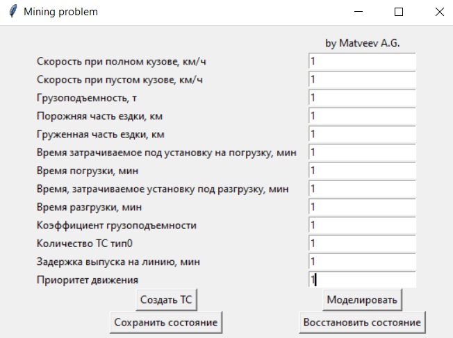
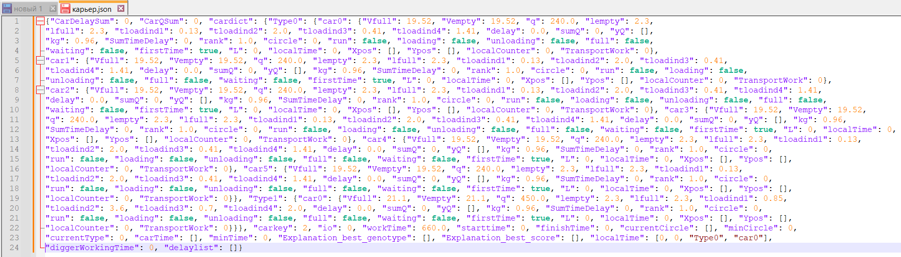
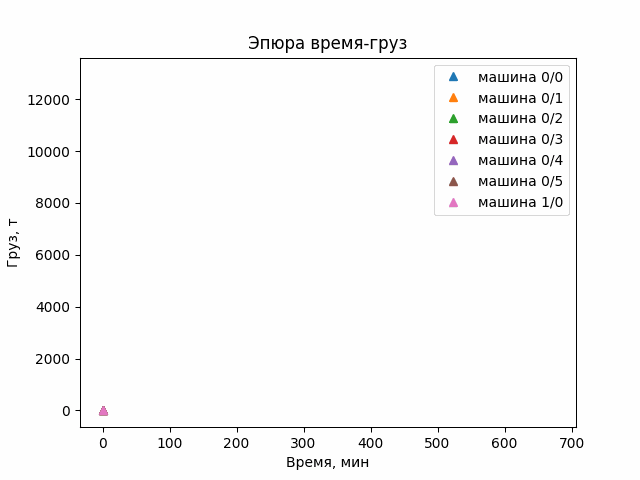
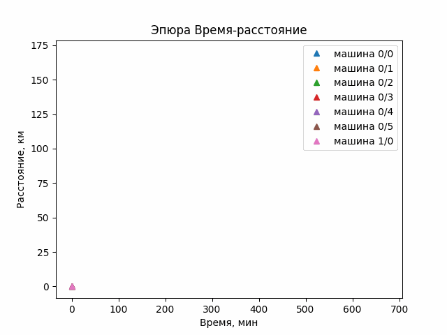
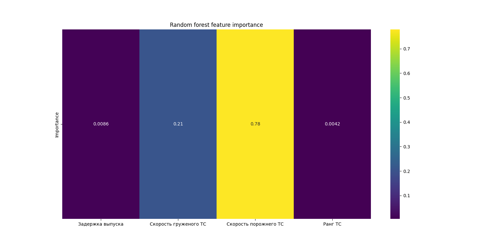
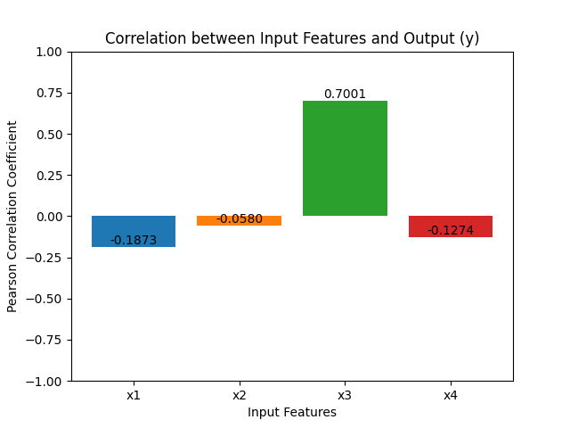

## Общие сведения
Программа «The Mine» Она предназначена для моделирования взаимодействия нескольких транспортных средств, оптимизации и анализа их работы с использованием генетического алгоритма. 
Программа написана на языке Python с использованием библиотек scikit-learn и matplotlib, seaborn и numpy.

## Функциональное назначение
Программа используется для численных экспериментов в области организации работы автомобилей-самосвалов и экскаваторов в циклических маятниковых перевозках. Она выполняет моделирование, анимацию графиков, интерпретацию результатов с использованием дерева случайных решений и коэффициентов корреляции Пирсона. Область применения включает в себя горнодобывающую отрасль и может быть расширена на другие сценарии, такие как управление городским транспортом, логистика складского хозяйства и управление проектами. 
 
 
*Структурная схема программы*

## Описание логической структуры
Программа имеет две основные процедуры: построение модели и генетический алгоритм. Первая процедура включает в себя создание модели с учетом введенных параметров пользователем.

## Технические средства
Программа требует запуска на компьютере с установленными библиотеками Python, включая scikit-learn и matplotlib, seaborn. Минимальные характеристики компьютера включают наличие Python 3.7+, оперативной памяти не менее 4 ГБ и процессора с тактовой частотой не менее 1.8 ГГц.

## Вызов и загрузка
Для использования программы, загрузите файл .py из репозитория, установите необходимые библиотеки, и запустите файл .py. Программа имеет интуитивно понятный GUI, и пользователь может следовать дополнительным сообщениям для настройки. 

 
 *Пользовательский интерфейс*

## Входные данные
Входные данные включают рабочее время, типы транспортных средств и их параметры. Пользователь также вводит информацию о задержке выпуска на линию, приоритете движения и других параметрах. Эти данные вводятся через GUI, а затем используются для моделирования и оптимизации. 
Предусмотрено хранение данных в формате json для последующего восстановления состояний работы программы.  

 
 *Данные прораммы в формате json*

## Выходные данные
Выходные данные включают интерактивные графики время-груз и время-расстояние с анимацией. Также предоставляется интерпретация результатов с распределением весов среди варьируемых критериев и коэффициентами корреляции Пирсона. Примеры визуализации результатов представлены на рисунках ниже.  

 
*Эпюра время-груз, анимация*

 
*Эпюра время-расстояние, анимация*

 
*Распределение весов среди варьируемых критериев при помощи случайного леса*

 
*Коэффициенты корреляции Пирсона для варьируемых критериев: x1 – задержка выпуска; x2 – скорость груженого ТС; x3 – скорость порожнего ТС; x4 – ранг ТС*

