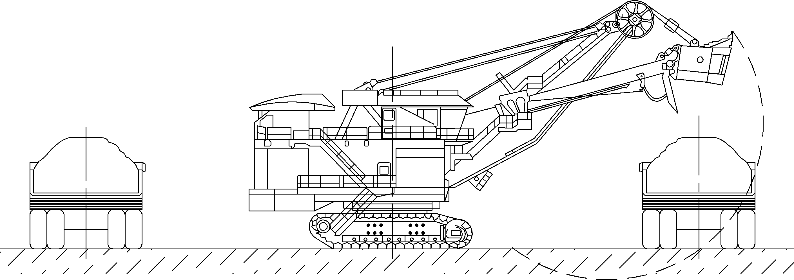
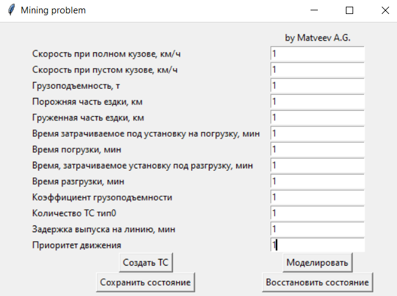
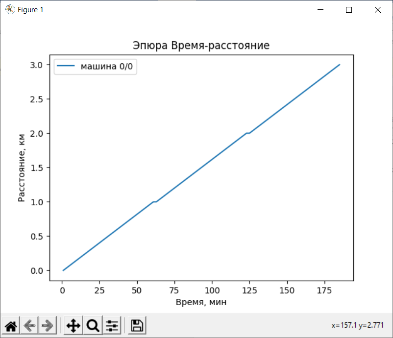
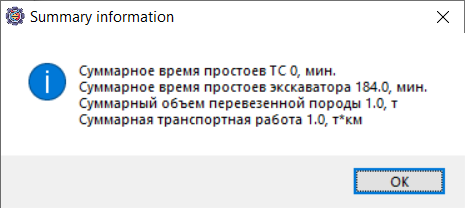
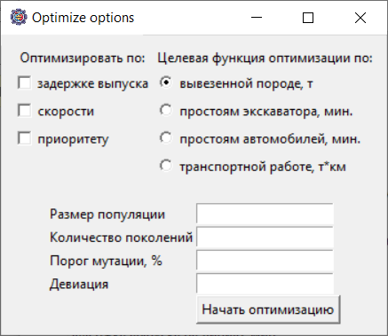
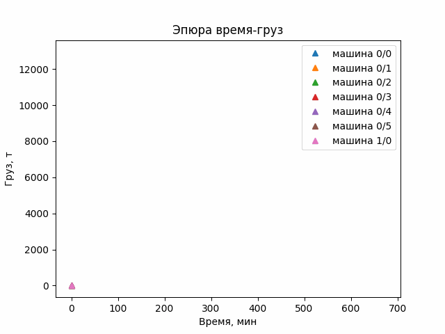
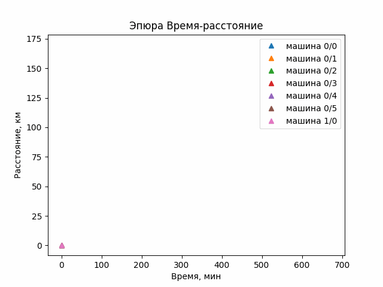
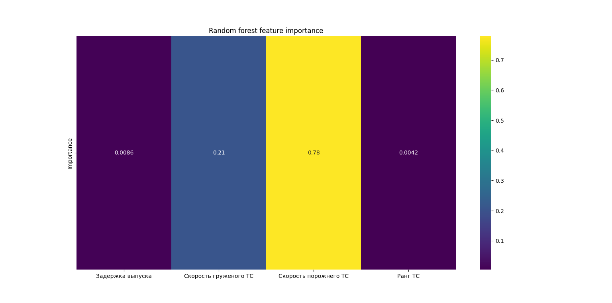
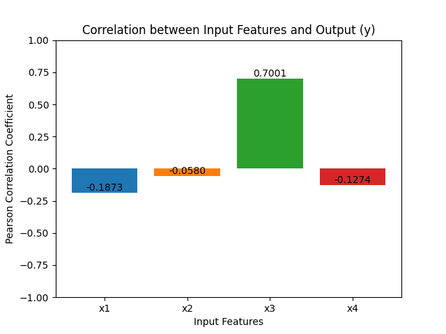

# The_mine

## Введение
Исходная идея проекта возникла в рамках работы, направленной на решение проблемы организации работы автомобилей-самосвалов и экскаваторов в циклических маятниковых перевозках на угольном разрезе. Различные модели автомобилей в колонне обладали уникальными характеристиками, препятствующих эффективному выполнению совместной работы. Для улучшения ситуации были разработаны правила проезда на точках погрузки, которые устанавливали порядок погрузки в зависимости от модели транспортного средства.

## Производственная проблема
Мы рассматриваем проблему на примере реальной производственной задачи, возникшей на угольном разрезе предприятия АО «Черниговец». На данном месторождении добыча ведется открытым способом, и для реализации внутренней логистики задействуются автомобильно-экскаваторные комплексы, включающие в себя экскаваторы P&H-2800 и карьерные самосвалы БелАЗ-75306 (грузоподъемность 240 тонн). В качестве эксперимента в состав одного комплекса был добавлен БелАЗ-75710 (грузоподъемность 450 тонн), значительно отличающийся по своим характеристикам от других моделей самосвалов. Работа этих самосвалов и экскаваторов по вывозу породы из карьера осуществляется через [два заезда под погрузку экскаватора](digpic.png) несколькими сменами (каждая по 11 часов). Порядок загрузки происходит по очереди на каждом пункте погрузки.

 
*Схема работы экскаватора на 2 подъезда*

Описанный выше базовый план работы одного участка погрузки на предприятии приводил к простою одного экскаватора в течение 173 минут, а суммарные простои 7 БелАЗов из 11-часовой смены составляли 474,3 минуты. Это, в свою очередь, приводило к значительным финансовым убыткам для предприятия.

## Что делает проект
Представленная программа помогает строить модели совместной работы нескольких транспортных средств (ТС) с возможностью детального представления свойств агента на каждой интеграции в течении всего времени исследования.
### Знакомство с программой
Сначала программа запрашивает «Рабочее время» в минутах (рис. 2). Это значение представляет собой временной отрезок, в течение которого будет производиться моделирование и исследование процессов.

 
 *Рис. 2. Указание параметра "рабочего времени" в минутах*

Рабочее время можно указывать нецелым. Однако стоит заметить, что в качестве дробного разделителя требуется использовать точку, а не запятую. То же справедливо для всех последующих полей ввода, где пользователь может вводить нецелые значения.
Далее открывается окно ввода параметров для ТС, а точнее типа ТС (рис. 2). Имеется ввиду, что в программе предусмотрены моделирование и исследование с одновременным использованием машин с разными характеристиками, касающиеся как самих транспортных средств, так и их маршрута.

 
 *Рис. 3. Передача пользователем о типе ТС*

Последовательно заполняются все параметры. Если какое-то поле будет пропущено или будет заполнено неправильно – программа выдаст ошибку и не запишет ТС. Значения полей могут быть произвольными, соответствующие физическим ожиданиям реального мира (например, отрицательные значения скорости будут отклонены).
Стоит отдельно рассмотреть поле «Задержка выпуска на линию». В это поле пользователь передает информацию о том сколько должно пройти минут от начала модельного времени, чтобы машина вышла на линию. Так как в каждый тип может быть записано сразу несколько ТС, то и данное поле может принимать массив данных времени, значения которых должны иметь в качестве дробного разделителя точку, а в качестве разделителя между элементами – точку с запятой. При несоответствии размерностей массива и количества ТС в типе будет применена задержка выпуска для всех ТС в типе по первому элементу массива. Соответствующие сообщения выводятся пользователю сплывающих окнах.
Следующее поле, требующее разъяснения – «Приоритет движения». Здесь передается одно целое число для всего типа ТС, характеризующее приоритет проезда места погрузки, т.е. при сценарии, когда одновременно грузятся две машины, будет сначала погружена та, у которой приоритет выше, а другая будет простаивать в ожидании. Допустимо использования одного значения для всех типов ТС, в таком случае порядок погрузки будет зависеть от очередности приезда по времени.
Для ознакомления, можно ввести 1 во все поля, как показано на Рис. 3.
По окончании заполнения всех полей ввода информации, необходимо записать тип ТС соответствующей кнопкой «Создать ТС».
После записи ТС, можно произвести моделирование нажатием кнопки «Моделировать».
Ниже представлены кнопки, которые можно задействовать только после записи ТС (рис. 4).

 
*Рис. 4. Кнопки анализа и управления информацией*

Когда моделирование окончено, можно отобразить полученные данные в виде графической информации выбрав необходимую эпюру и затем нажав кнопку «Показать график» (рис. 5).

 
*Рис. 5. Эпюра время-расстояние*

Выведенный график является интерактивным. Его можно увеличивать и уменьшать в окне просмотра, можно сохранить на компьютер в разных форматах, а также осуществить дополнительные настройки в окне settings. На график также выводится легенда со следующим синтаксисом: машина [тип ТС]/[# ТС].
Кнопка «стереть» выполняет соответствующую функцию удаления всей информации.
Кнопка «Запись данных» выполняет запись данных моделирования в файл с расширением .csv.
Кнопка «Сводная информация» показывает всплывающее окно со сводной информацией, которая также выводится в файл csv (рис. 6).

 
*Рис. 6. Вывод сводной информации после проведения моделирования*

Кнопки «Сохранить состояние» и «Восстановить состояние» реализуют соответствующие названию действия с приобретенным прогрессом.
Кнопка «Оптимизировать» вызывает форму для ввода параметров оптимизации (рис. 7).

 
*Рис. 7. Форма параметров оптимизации*

Оптимизацию целевой функции можно производить по одному из признаков: вывезенной породе; простоям экскаватора; простоям автомобилей; транспортной работе. «Оптимизацию по» или _оптимизацию чего_ можно производить одновременно всех параметров или одного из списка: задержка выпуска; скорость; приоритет.
Далее выбирается «размер популяции» - это целое число характеризующее величину единовременно созданных моделей идентичных той, которая задана пользователем. «Количество поколений» - целое число, показывающее количество смен популяций. «Порог мутации» - измеряется в проценте, соответственно принимает значения от 0 до 1. Этот параметр показывает вероятность возникновения мутации. «Девиация» - параметр отклонения исследуемого параметра. Он задается один для всех варьируемых величин и его значение представляет собой огромное поле для экспериментов.
От правильно выбранных параметров генетического алгоритма будет зависеть конечная модель. Здесь стоит отметить важную роль эксперта или оператора, взаимодействующего с данной программой. На основании своего опыта он должен выставлять такие данные, чтобы оптимизация происходила максимально быстро с выдачей лучших результатов.
Генетический алгоритм имеет эвристический подход к решению поставленных задач. Это говорит о том, что результаты оптимизации не стоит определять, как наилучшие. Результаты алгоритма могут быть даже хуже, чем модель, заданная пользователем. Однако это не говорит о неработоспособности программы, а указывает на особенности ее использования и важность принятия решений со стороны пользователя.
Для апробирования, параметры в форме генетического алгоритма можно задать как 1 во всех полях. По окончании, программа сформирует модель по лучшему результату алгоритма, и пользователь сможет записать данные в файл csv, посмотреть графики и получить сводную информацию по средствам вызова вышеописанных кнопок.

Также внедрены следующие функциональности: анимация графиков для более полного понимания процесса построения моделей, что способствует выявлению «узких мест» при взаимодействии агентов (рис. 8, рис. 9); возможность «объяснять» шаги генетического алгоритма (ГА) с целью более глубокой _интерпретации_ информации и ее более детального изучения и улучшения. 

 
*Рис. 8. Эпюра время-груз, анимация*

 
*Рис. 9. Эпюра время-расстояние, анимация*

Интерпретация в программе базируется на дереве случайных решений и коэффициентах корреляции Пирсона. Первый метод предоставляет информацию об общем распределении вклада каждого из варьируемых показателей в решение, полученное с использованием ГА (рис. 10), в то время как второй метод отражает тенденцию изменения целевой функции при изменении соответствующего показателя (рис. 11).

 
*Рис. 10. Распределение весов среди варьируемых критериев при помощи случайного леса*

 
*Рис. 11. Коэффициенты корреляции Пирсона для варьируемых критериев: x1 – задержка выпуска; x2 – скорость груженого ТС; x3 – скорость порожнего ТС; x4 – ранг ТС*

## Как попробовать
1.	загрузите файл .py из репозитория;
2.	установите необходимые библиотеки, включая scikit-learn и matplotlib;
3.	запустите файл .py.
Используйте интуитивно понятный GUI и следуйте дополнительным сообщениям для первоначальной настройки. Ознакомьтесь с инструкцией [ссылке](https://disk.yandex.ru/i/g4RggZGAa_s_ig) для более глубокого понимания функционала.

## Полезность проекта
Проект полезен для моделирования взаимосвязей в работе и последующих корректировок и улучшений. Пользователи могут анализировать различные модели и оптимизировать маршруты для повышения эффективности процессов. Несмотря на кажущуюся простоту и отношение к проблеме горнодобывающей отрасли, сценариев применения данной программы достаточно много. Так, например, можно моделировать, исследовать и оптимизировать движение городского транспорта, добиваясь устойчивого промежутка времени между ТС, их скорости или конкретного времени прибытия на остановку или конечный пункт; можно попробовать алгоритм под логистику складского хозяйства, рассматривая в виде агентов отдельные товары, работников или места хранения; можно попробовать использовать программу в управлении людьми или проектами и многое другое. Вместе с тем, добавленная возможность интерпретации эвристических решений позволит пользователю углубить свое понимание и исследуемом вопросе и поможет указать направления улучшения решаемой задачи.
